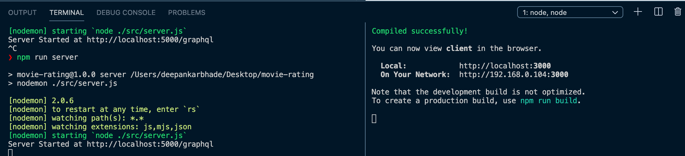

## 🚀 React-Apollo-GraphQL 🧬

#### 🏗 This is still under development project for my GraphQL Playground which will be embedded in my Personal Website 👨🏽‍💻.

#### 1. React

#### 2. Apollo

#### 3. GraphQL

#### 4. Express

`client` directory has the React files

Open up 2 Terminal and do `cd client` in one of them

#### To Run

Run `npm run start` for react-apollo client.
Run `npm run server` for apollo-graphQl server.

They both should run concurrently.



Visit to view GraphQL playground http://localhost:5000/

### Queries :

#### Give all Movies

```graphql
query {
  movies {
    name
    genres
    language
    rating
  }
}
```

#### Searched for Movie Based on Genres

```graphql
query {
  moviesGenres(genre: "Thriller") {
    name
    genres
    language
    rating
  }
}
```

#### Sortes Movies Based on Ratings

```graphql
query {
  query {
    moviesList(sorted: true) {
      name
      genres
      language
      rating
    }
  }
}
```
